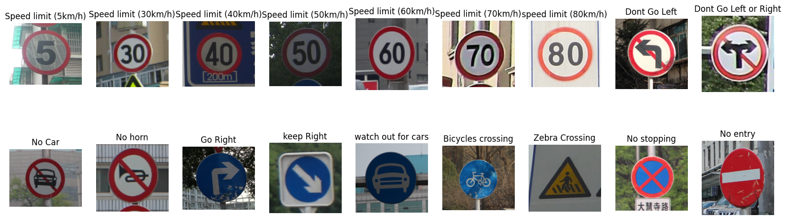
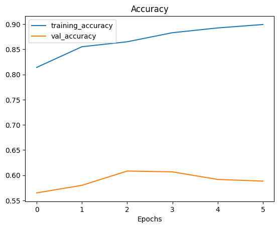
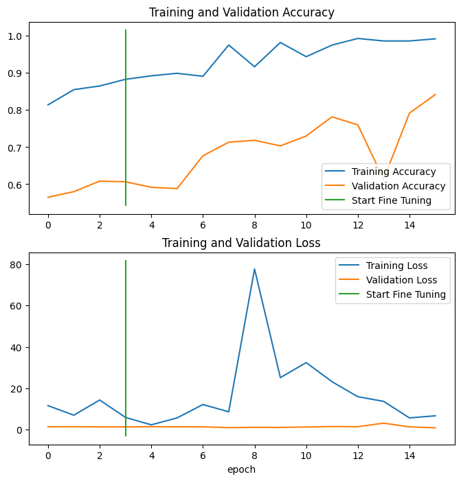

## A Simple computer vision project written for my university course

### [kaggle notebook](https://www.kaggle.com/code/shayanheidari/traffic-sign-classification-ipy)
### Dataset

I choose [Chine Traffic Sign Dataset](https://www.kaggle.com/datasets/ahemateja19bec1025/traffic-sign-dataset-classification) from kaggle which contains images from **58** different traffic signs in *china* then I reduce the numbder of classes to **18** which was similar to iran traffic signs then I work with this 18 classes.

### Base Model
I tested some models such as ***Mobilenet***, ***Resnet***, ***Inception v3*** but I found **VGG16** gives me best accuracy of them all so I stick with it.

As you can see there is 16 layers in this model which is pretty simple is comparison to other state of the art models, [there](https://arxiv.org/abs/1409.1556) is VGG16 orginal paper and [this](https://www.kaggle.com/code/blurredmachine/vggnet-16-architecture-a-complete-guide) is a nice guid to this model, and if you want some visualization check this [website](https://poloclub.github.io/cnn-explainer/) it's a visual representation of TinyVGG a simpler version of our base model.

and here is accuracy plot of the base model

### Fine Tuning
After I extract features from the base model then I unfreeze last 5 layer of my base model and then fine tune it for 10 more epochs and results were good

### Final Accuracy
And after fine tunning we achive accuracy of 0.8720 and loss of 0.7194 wich are good for 18 classes.

